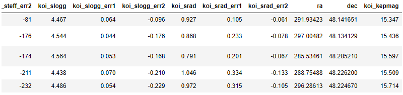

# Machine Learning - Exoplanet Exploration

## The Challenge!!!
Over a period of nine years in deep space, the NASA Kepler space telescope has been out on a planet-hunting mission to discover hidden planets outside of our solar system.

To help process this data, you will create machine learning models capable of classifying candidate exoplanets from the raw dataset.

When we load the dataset, we find that it has 41 columns or features. When we try to predict the accuracy of any model, it is very important that we pick the right features. Poor feature selection can lead to a lower prediction accuracy of our model.

So now the challenge is to find which features are useful and which are not.

As we can see, the values in our features ranges from very high to very low. Since features have different scales, there is a chance that higher weightage is given to features with higher magnitude. This will impact the performance of the machine learning algorithm and we do not want our algorithm to be biased towards one feature. The first thing that we need to do is scale the features.

## Logistic Regression

Once the scaling is done, we calculate the accuracy of our model.

	Training Data Score: 85.50 %
	Testing Data Score: 86.21 %

#### Selecting Features

Here, I used SelectKBest package from sklearn. Once executed, we get a list of features and their scores. We can then sort them in descending order and select the ones we want. I selected top 10. Now we should scale the selected features again before we train and test our model.

I did a test here by training and testing the model without scaling. Here are the results:

	Train Data Score: 65.95%
	Test Data Score: 64.13%

And here are results after I scaled the features:

	Train Data Score: 84.59%
	Test Data Score: 84.38%

## Random Forest

Let’s test our model with Random Forest classification. Everything would remain the same where we scale out model and train and test it. But this time, instead of Logistic Regression, we use Random Forest. With this, our base model scores were:

	Train Data Score: 100.0%
	Test Data Score: 89.7%

After tuning the model, our testing accuracy improved:

	Training Data Score: 98.245 %
	Testing Data Score: 90.046 %

For this dataset, it is clear that Random Forest is the better approach.
